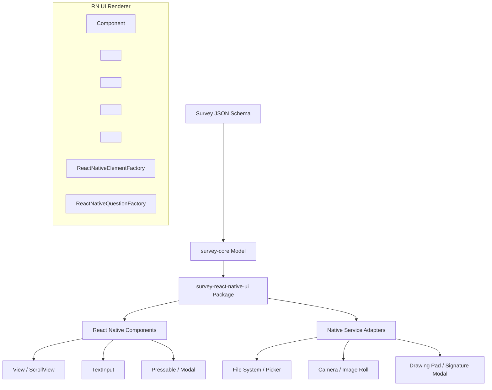

# React Native Rendering Support for SurveyJS - Implementation Plan

This implementation plan details the architecture, safety protocols, and implementation phases for adding native mobile rendering support to the SurveyJS Form Library using React Native 0.86 (React Native CLI).

---

## Git Safety Findings

> [!WARNING]
> The current Git configuration tracks the official upstream SurveyJS repository on the `master` branch. Pushing to this remote directly is restricted.

- **Current Branch**: `feature/react-native-renderer`
- **Tracking Remote**: `origin` (`https://github.com/surveyjs/survey-library.git`)
- **Status**: Checked out local branch, not tracking upstream `origin` for push.
- **Safety Status**: **SAFE**. Pushes will be targeted to `private-fork` pointing to `https://github.com/sukhi-alba/survey-library.git`.
- **Remote Setup**:
  - `origin` -> `https://github.com/surveyjs/survey-library.git` (Official Upstream)
  - `private-fork` -> `https://github.com/sukhi-alba/survey-library.git` (Personal Fork)

---

## Repository Reconnaissance Findings

### 1. `survey-core` Environment Decoupling
- **Analysis**: The core engine isolates environment-specific APIs (window, document, DOM events) using wrappers like `DomWindowHelper` and `DomDocumentHelper` (in [`global_variables_utils.ts`](file:///c:/Users/Ricky/Documents/oceanaut/survey-form/packages/survey-core/src/global_variables_utils.ts)).
- **Result**: If window or document is undefined (as in React Native), the helpers return `undefined`/do nothing rather than crashing. ResizeObservers, drag-drop adapters, and browser-only scrolling check helper presence and bypass their execution on non-browser targets.

### 2. Rendering & Factory Design
- **Analysis**: React Web UI rendering is split into:
  - `ReactElementFactory` (for generic structures like pages, panels, and rows).
  - `ReactQuestionFactory` (for concrete input types).
- **RN Support**: We will replicate this pattern by introducing `ReactNativeElementFactory` and `ReactNativeQuestionFactory` to map question JSON types (e.g., `"text"`, `"comment"`) directly to native mobile renderers without affecting web templates.

### 3. PanelDynamic & Expression Subsystems
- **Dynamic Panels**: Represented by `QuestionPanelDynamicModel` in `survey-core`. It manages index tracking, validations, visibility, and value storage. We will render its inner panels dynamically using `renderedPanels` and binding layout actions to `footerToolbar`.
- **Expression Evaluation**: Governed by platform-neutral JS logic in `survey-core` conditions.

### 4. File / Image / Signature Handling
- **File & Image**: Native mobile uses file-system URIs and camera permissions instead of browser `<input type="file">`.
- **Signature**: The web model uses a DOM `<canvas>` and the `signature_pad` NPM package. In React Native, canvas APIs are not natively present, requiring a touch drawing surface or canvas wrapper.

---

## Proposed RN Architecture



### Component Structure
- **`<Survey>`**: Holds the root model, listens for page/completed state changes, renders the navigation buttons, and maintains the Table of Contents (TOC).
- **`<SurveyPage>`**: Renders current page questions in a `<ScrollView>` (or `<KeyboardAvoidingView>`).
- **`<SurveyRow>` & `<SurveyRowElement>`**: Build flexible grid layouts using Flexbox instead of table rows.
- **`<SurveyQuestion>`**: Standardized question container wrapper that renders:
  - Question Title & Description
  - Question Errors (using `<SurveyElementErrors>`)
  - The concrete input control (resolved dynamically from `ReactNativeQuestionFactory`).

### Reactivity Bridge
A custom base class `ReactNativeSurveyElement` (inheriting from `React.Component`) will subscribe to the underlying model's event listeners:
- `stateElement.addOnPropertyValueChangedCallback(handler)`
- `stateElement.addOnArrayChangedCallback(handler)`
When a property or array in `survey-core` changes (e.g. due to expressions or validation), the handler calls `this.setState` or `forceUpdate` to trigger a React Native update.

### Native Adapters (Dependency Injection)
To avoid hardcoding file pickers or drawing libraries, the `<Survey>` component will accept a `services` prop:
```typescript
interface ISurveyServices {
  filePicker?: {
    pickFiles: () => Promise<Array<{ name: string, uri: string, type: string, size: number }>>;
  };
  imagePicker?: {
    takePhoto: () => Promise<{ name: string, uri: string, type: string }>;
  };
  signature?: {
    captureSignature: () => Promise<string>; // returns base64 data URL
  };
}
```

---

## Proposed Changes

We will introduce a completely isolated package under `packages/` to avoid any modifications or regressions on existing web packages.

### [packages/survey-react-native-ui]

#### [NEW] [package.json](file:///c:/Users/Ricky/Documents/oceanaut/survey-form/packages/survey-react-native-ui/package.json)
Contains package information, workspace references, and peer dependencies on `react-native` and `survey-core`.

#### [NEW] [tsconfig.json](file:///c:/Users/Ricky/Documents/oceanaut/survey-form/packages/survey-react-native-ui/tsconfig.json)
Configures TypeScript for compiling React Native TSX files.

#### [NEW] [ReactNativeQuestionFactory](file:///c:/Users/Ricky/Documents/oceanaut/survey-form/packages/survey-react-native-ui/src/react-native-question-factory.ts)
Registry factory for React Native question renderers.

#### [NEW] [ReactNativeElementFactory](file:///c:/Users/Ricky/Documents/oceanaut/survey-form/packages/survey-react-native-ui/src/react-native-element-factory.ts)
Registry factory for React Native layout structure renderers.

#### [NEW] [SurveyComponent](file:///c:/Users/Ricky/Documents/oceanaut/survey-form/packages/survey-react-native-ui/src/Survey.tsx)
Root Survey component wrapping model lifecycles and page navigation.

#### [NEW] [QuestionComponents](file:///c:/Users/Ricky/Documents/oceanaut/survey-form/packages/survey-react-native-ui/src/questions/)
Folder containing native implementations for initial question types:
- `TextQuestion.tsx`
- `CommentQuestion.tsx`
- `CheckboxQuestion.tsx`
- `RadioQuestion.tsx`
- `DropdownQuestion.tsx`
- `ExpressionQuestion.tsx`
- `PanelDynamicQuestion.tsx`
- `FileQuestion.tsx`
- `ImageQuestion.tsx`
- `SignatureQuestion.tsx`

---

## Open Questions

> [!IMPORTANT]
> Please review and provide feedback on the following implementation details:

1. **Third-Party Canvas/Drawing Dependency**:
   For the `Signature` question, would you prefer that we implement it by providing a mock drawing surface using React Native SVG/gesture handlers inside the package, or rely on a standard dependency-injected Modal service from the host application? (Using the dependency injection `services.signature` is recommended to keep the library lean and avoid native build dependencies).
2. **Icons & Assets**:
   Web rendering imports SVG icons. In React Native, SVGs require packages like `react-native-svg`. We propose using simple Unicode symbols or dependency-injected icons for navigation/collapsing to avoid forcing native package configurations on the host app.

---

## Verification Plan

### Automated Tests
We will add a unit test suite under `packages/survey-react-native-ui/tests/` to verify:
- Loading real JSON forms and checking survey state updates.
- Value updates in text, checkbox, radiogroup, expression, and dynamic panels.
- Navigation page changes and completing triggers.
- Compatibility of values/data generated by the RN renderer with web models.

```bash
# Run unit tests
npm run test --prefix packages/survey-react-native-ui
```

### Manual Verification
- Render the survey elements using a mock React Native view harness.
- Verify validation triggers and expressions in dynamic forms.
