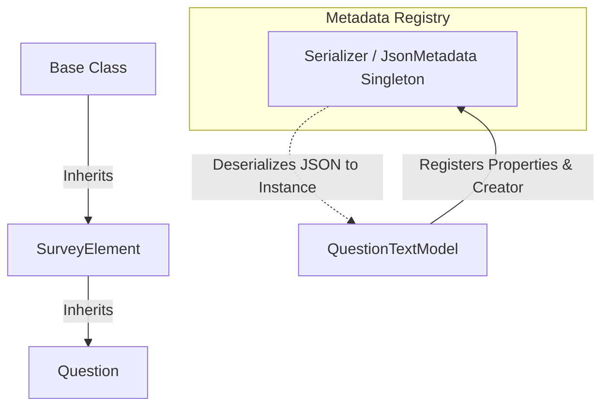
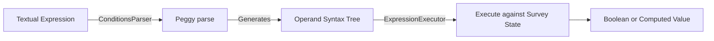

# SurveyJS Form Library - Codebase & Architecture Reference

This reference guide provides a comprehensive overview of the **SurveyJS Form Library** (`survey-library`) repository, explaining the project structure, dependency system, core metadata/serialization registry, parser grammar, reactive framework wrappers, theming, and testing pipelines.

---

## 1. Monorepo Repository Layout & Packages

The repository is structured as a monorepo containing multiple packages under the `packages/` directory. Although they share a root configuration for developer tools (like ESLint, Playwright, and Husky), **npm workspaces are not used**; instead, each package installs its dependencies and builds independently.

### Packages Overview
- **[`survey-core`](file:///c:/Users/Ricky/Documents/oceanaut/survey-form/packages/survey-core)**: The central, platform-independent survey engine. It contains all business logic, serialization metadata, survey validation, condition and expression runner, localization strings, and default theme styles (SCSS/CSS).
- **[`survey-react-ui`](file:///c:/Users/Ricky/Documents/oceanaut/survey-form/packages/survey-react-ui)**: React (React 17 compatible) rendering library written in TypeScript (`.tsx`) and compiled with Rollup.
- **[`survey-vue3-ui`](file:///c:/Users/Ricky/Documents/oceanaut/survey-form/packages/survey-vue3-ui)**: Vue 3 rendering library using single-file components (`.vue`) and compiled with Vite.
- **[`survey-angular-ui`](file:///c:/Users/Ricky/Documents/oceanaut/survey-form/packages/survey-angular-ui)**: Angular (Angular 12+) rendering library built using `ng-packagr`.
- **[`survey-js-ui`](file:///c:/Users/Ricky/Documents/oceanaut/survey-form/packages/survey-js-ui)**: Framework-free rendering layer for HTML/CSS/JavaScript (Vanilla JS).

### Build-Time Coupling & Symlinks
Every UI rendering package has a dependency on `survey-core`. Locally, this is wired up by creating a **junction symlink** inside the UI package's `node_modules` pointing directly to the build output of `packages/survey-core/build`.
> [!IMPORTANT]
> `packages/survey-core` **must** be compiled first before attempting to build or run tests on any framework-specific UI package.

---

## 2. Core Build & Compilation Pipeline

### Core Rollup Bundles
`packages/survey-core` utilizes multiple Rollup configuration files to build the engine:
1. **`rollup.config.mjs`**: Compiles the main TypeScript bundle (`survey-core.js`/`.min.js`) and extracts styles (`survey-core.css`/`.min.css`).
2. **`rollup.i18n.config.mjs`**: Builds the localization dictionaries for more than 50 languages (loaded dynamically or bundled).
3. **`rollup.themes.config.mjs`**: Compiles the JSON representation of themes.
4. **`rollup.icons.config.mjs`**: Packages SVGs into bundles.
5. **`rollup.adapters.config.mjs`**: Compiles adapters for UI styling extensions (like Bootstrap or MUI).

### Shared Bundling Helper
The root [`rollup.helpers.mjs`](file:///c:/Users/Ricky/Documents/oceanaut/survey-form/rollup.helpers.mjs) handles UMD and ESM build setups, integrating:
- **`@rollup/plugin-typescript`**: Typechecks and transpiles source code.
- **`rollup-plugin-postcss`**: Extracts, resolves (inlines url assets), and prefixes SCSS stylesheets.
- **`terser` & `cssnano`**: Minifies the resulting JavaScript and CSS artifacts on demand.

---

## 3. The Backbone: JSON Serialization & Metadata System

SurveyJS surveys are JSON-driven. A survey layout is represented by a JSON schema, which is parsed into runtime models and serialized back. This reflection layer resides in [`packages/survey-core/src/jsonobject.ts`](file:///c:/Users/Ricky/Documents/oceanaut/survey-form/packages/survey-core/src/jsonobject.ts).



### Key Subsystems
- **`Serializer`** (the `JsonMetadata` singleton): The central registry containing all serializable classes, inheritance patterns, and registered property descriptors.
- **`Base`** ([`packages/survey-core/src/base.ts`](file:///c:/Users/Ricky/Documents/oceanaut/survey-form/packages/survey-core/src/base.ts)): The base class for all serializable model objects. It stores property values in an internal hash map, resolves bindings, triggers `onPropertyChanged` notifications, and serves as the bridge to UI framework reactive wrappers.

### Concrete Registration Example
Any serializable class registers itself in a static execution block (often at the bottom of its file) by calling `Serializer.addClass`. Here is how the `text` question type registers in [`packages/survey-core/src/question_text.ts`](file:///c:/Users/Ricky/Documents/oceanaut/survey-form/packages/survey-core/src/question_text.ts#L932-L1092):

```typescript
Serializer.addClass(
  "text",
  [
    {
      name: "inputType",
      default: "text",
      choices: settings.questions.inputTypes,
    },
    {
      name: "maxLength:number",
      default: -1,
      visibleIf: (obj: any) => obj.isTextInput,
    },
    {
      name: "placeholder",
      serializationProperty: "locPlaceholder",
      visibleIf: (obj: any) => obj.isTextInput,
    }
  ],
  function() {
    return new QuestionTextModel("");
  },
  "textbase" // Parent class
);
```

---

## 4. Core Model Hierarchy

The survey-core engine models follow a strict object-oriented hierarchy:

1. **`Base`** ([`base.ts`](file:///c:/Users/Ricky/Documents/oceanaut/survey-form/packages/survey-core/src/base.ts)): Standard base class for property change notification, array modifications, serialization, and expression bindings.
2. **`SurveyElementCore`** ([`survey-element.ts`](file:///c:/Users/Ricky/Documents/oceanaut/survey-form/packages/survey-core/src/survey-element.ts)): Adds localization features (`ILocalizableOwner`), page/survey layout hooks, and state.
3. **`SurveyElement`** ([`survey-element.ts`](file:///c:/Users/Ricky/Documents/oceanaut/survey-form/packages/survey-core/src/survey-element.ts)): Adds common properties for questions, pages, and panels, including visible, enabled, read-only, and CSS class construction.
4. **`Question`** ([`question.ts`](file:///c:/Users/Ricky/Documents/oceanaut/survey-form/packages/survey-core/src/question.ts)): Parent class for all concrete questions (checkbox, dropdown, file, comment, matrix, signaturepad, rating).
5. **`PanelModelBase`** ([`panel.ts`](file:///c:/Users/Ricky/Documents/oceanaut/survey-form/packages/survey-core/src/panel.ts)): Parent class for structural containers like `PanelModel` and `PageModel`.
6. **`SurveyModel`** ([`survey.ts`](file:///c:/Users/Ricky/Documents/oceanaut/survey-form/packages/survey-core/src/survey.ts)): The top-level root model orchestrating pages, responses data, validation, calculation variables, translation localization, and navigation triggers.

---

## 5. Expression & Conditions Parsing Engine

Triggers, visible-ifs, custom rules, and calculated values are written as textual expressions. SurveyJS parses these expressions using a custom Peggy/PEG.js grammar defined in [`packages/survey-core/src/expressions/grammar.pegjs`](file:///c:/Users/Ricky/Documents/oceanaut/survey-form/packages/survey-core/src/expressions/grammar.pegjs).

### Parser & Executor Flow


### Expression Features
- **Logical / Comparison**: `&&`, `||`, `==`, `!=`, `<`, `>`, `>=`, `contains`, `anyof`, `allof`, `noneof`.
- **Arithmetic**: `+`, `-`, `*`, `/`, `%`, `^` (power).
- **Functions**: Registers common formulas via `FunctionFactory` (in [`functionsfactory.ts`](file:///c:/Users/Ricky/Documents/oceanaut/survey-form/packages/survey-core/src/functionsfactory.ts)):
  - Aggregations: `sum`, `min`, `max`, `count`, `avg`.
  - Date helpers: `today`, `currentDate`, `age`, `dateDiff`, `dateAdd`, `diffDays`.
  - Conditionals: `iif`.
  - Utilities: `displayValue`, `propertyValue`, `substring`, `getComment`.

---

## 6. Reactivity Bridges: Core to UI Renderers

Because `survey-core` is framework-agnostic, each framework-specific package maps model notifications to its own change detection:

### A. React (`packages/survey-react-ui`)
Built inside [`reactquestion_element.tsx`](file:///c:/Users/Ricky/Documents/oceanaut/survey-form/packages/survey-react-ui/src/reactquestion_element.tsx):
- `SurveyElementBase` registers property changed callbacks:
  - `stateElement.addOnPropertyValueChangedCallback(...)`
  - `stateElement.addOnArrayChangedCallback(...)`
- When the core model changes, the callback updates component state (`this.setState(...)`), triggering React's `forceUpdate` or reconciliation cycle.
- On unmount, event handlers are detached (`removeOnPropertyValueChangedCallback`).

### B. Vanilla JS / jQuery (`packages/survey-js-ui`)
A clever design architecture is utilized here:
- **`survey-js-ui` is not a separate renderer!** It is a wrapper over `survey-react-ui`.
- Its configuration compiles using **Preact** via rollup aliases:
  ```javascript
  const aliases = {
    "react": "preact/compat",
    "react-dom": "preact/compat"
  };
  ```
- The entry point [`packages/survey-js-ui/entries/index.ts`](file:///c:/Users/Ricky/Documents/oceanaut/survey-form/packages/survey-js-ui/entries/index.ts) compiles the React components into a Preact bundle and registers a jQuery plugin (`$().Survey({ model })`) under the hood.

### C. Vue 3 (`packages/survey-vue3-ui`)
Built inside [`packages/survey-vue3-ui/src/base.ts`](file:///c:/Users/Ricky/Documents/oceanaut/survey-form/packages/survey-vue3-ui/src/base.ts):
- It intercepts getters and setters on the core model:
  - `getPropertyValueCoreHandler` wraps values inside custom Vue 3 references (`customRef`).
  - `setPropertyValueCoreHandler` triggers updates on those custom refs.
  - `createArrayCoreHandler` returns array reactive wrappers.
- The `useQuestion(props, root, ...)` composition helper hooks the Vue component lifecycle into rendering callbacks like `afterRenderQuestionElement`.

### D. Angular (`packages/survey-angular-ui`)
Built inside [`packages/survey-angular-ui/src/base-angular.ts`](file:///c:/Users/Ricky/Documents/oceanaut/survey-form/packages/survey-angular-ui/src/base-angular.ts):
- Component base class `BaseAngular` subscribes to property/array changes.
- Upon receiving a change event:
  - If the property requires immediate updates, it runs `detectChanges()` synchronously.
  - Otherwise, it schedules a microtask to debounce updates, and then runs `detectChanges()` to re-render the view.

---

## 7. Theming & Styling System

SurveyJS styling is authored in SCSS under `packages/survey-core/src/default-theme/` and compiled to CSS via PostCSS.

- **Theme Interface**: [`ITheme`](file:///c:/Users/Ricky/Documents/oceanaut/survey-form/packages/survey-core/src/themes.ts) controls custom styling headers, fonts, background images, positioning, layout widths, and overrides CSS variables.
- **Theme Variables Mapping**: `patchLegacyCSSVariables` translates old CSS variables (`--sjs-font-size`, `--sjs-questionpanel-backcolor`) into the modern CSS variables system (`--sjs2-base-unit-font-size`, `--sjs2-color-component-panel-default-bg`).
- **Framework Adapters**: SCSS styling variables are mapped to common UI kits (Bootstrap, MUI, Shadcn) in `packages/survey-core/src/themes/adapters/`.

---

## 8. Testing Infrastructure

Tests are separated into two tiers to ensure complete coverage:

### Vitest Unit Tests
- **survey-core**: Located under `packages/survey-core/tests/`. Vitest runs with `jsdom` configuration to mock browser APIs.
  - Run with: `npm run test` (or `vitest run tests/<file>.ts` for a single file).
- **UI Renderers**: Verify markup structure, snapshot correctness, and framework-level interactions.

### Playwright Integration, Visual Regression, & Accessibility Tests
Configured in the root [`playwright.config.ts`](file:///c:/Users/Ricky/Documents/oceanaut/survey-form/playwright.config.ts), sharing three projects across packages:
1. **`a11y`**: Automated accessibility checks using `axe-playwright` and `axe-core`.
2. **`vrt`**: Visual regression tests using `devextreme-screenshot-comparer`.
3. **`e2e`**: End-to-end user behavior simulation.

Each UI package starts its own local development server dynamically during test execution.
